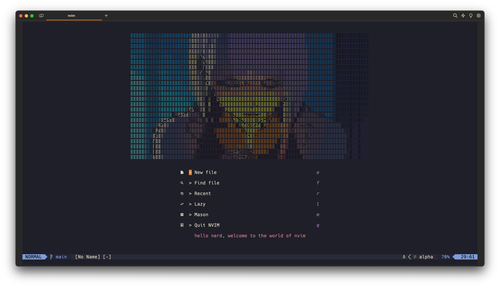

# Neovim Configuration

This is my personal neovim configuration. It is a work in progress and is subject to change. It was inspired by
- [ThePrimeagen](https://www.youtube.com/c/ThePrimeagen)
- [Nerd Signals](https://www.youtube.com/@bjcampolo)
- [typecraft](https://www.youtube.com/@typecraft_dev)

